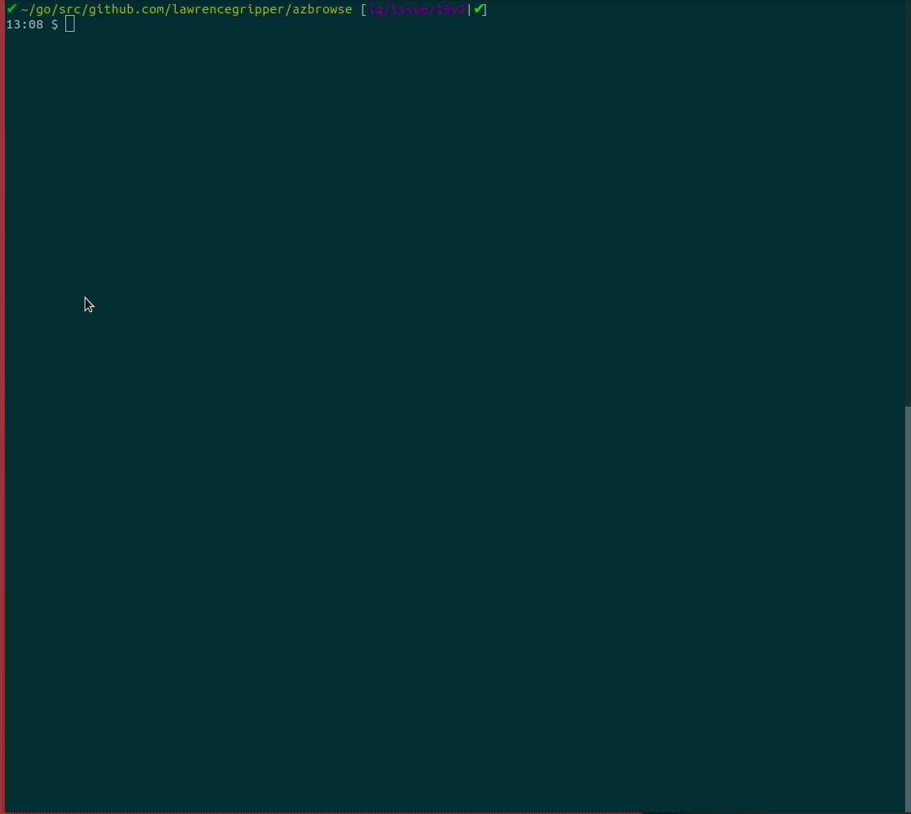
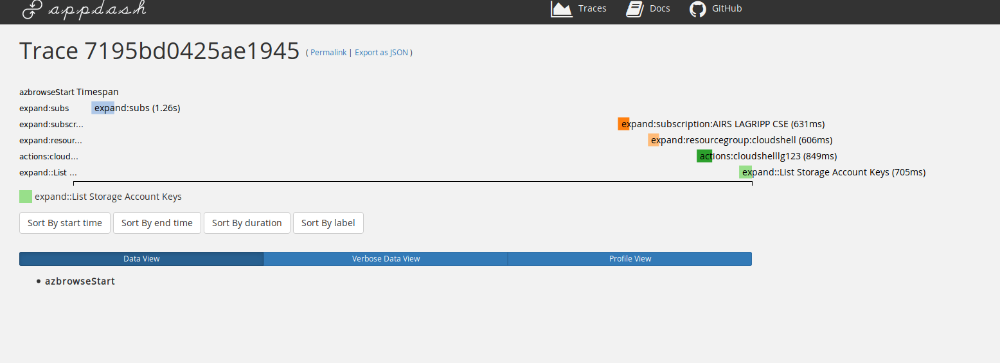

# AzBrowse

An interactive CLI for browsing azure resources, inspired by [resources.azure.com](https://resources.azure.com)

# Quick Start

Simply download the binary suitable for your machine, [from the release page](https://github.com/lawrencegripper/azbrowse/releases), and execute it. 

### Status

It's an MVP to prove out the use case. Basic navigation and operations with a boltdb based cache for expensive (slow) API calls.

Currently I'm using it every day **but it is experimental so use with caution on a production environment!!**

### Usage

## Navigation 

| Key       | Does                 | 
| --------- | -------------------- | 
| ↑/↓       | Select resource      |
| Backspace | Go back              |
| ENTER     | Expand/View resource |

## Operations

| Key                 | Does                      |                                                                                    |
| ------------------- | ------------------------- | ---------------------------------------------------------------------------------- |
| CTRL+E              | Toggle Browse JSON        | For longer responses you can move the cursor to scroll the doc                     |
| CTRL+o (o for open) | Open Portal               | Opens the portal at the currently selected resource                                |
| DEL:                | Delete resource           | The currently selected resource will be deleted (Requires double press to confirm) |
| CTLT+F:             | Toggle Fullscreen         | Gives a fullscreen view of the JSON for smaller terminals                          |
| CTLT+S:             | Save JSON to clipboard    | Saves the last JSON response to the clipboard for export                           |
| CTLT+A:             | View Actions for resource | This allows things like ListKeys on storage or Restart on VMs                      |

## Debugging

Running `azbrowse --debug` will start an in-memory collector for the `opentracing` and a GUI to browse this at http://localhost:8700. You can use this to look at tracing information output by `azbrowse` as it runs.

## Plans

[Issues on the repository track plans](https://github.com/lawrencegripper/azbrowse/issues), I'd love help so feel free to comment on an issue you'd like to work on and we'll go from there.